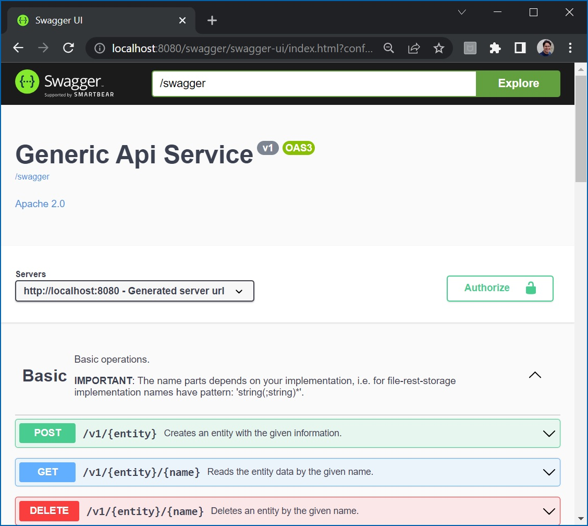

# rest-storage

[](https://github.com/thiagolvlsantos/rest-storage/actions/workflows/maven.yml)
[](https://github.com/thiagolvlsantos/rest-storage/actions/workflows/codeql.yml)
[](https://github.com/thiagolvlsantos/rest-storage/actions/workflows/sonar.yml)
[](https://sonarcloud.io/dashboard?id=thiagolvlsantos_rest-storage)
[](https://sonarcloud.io/dashboard?id=thiagolvlsantos_rest-storage)
[](https://repo1.maven.org/maven2/io/github/thiagolvlsantos/rest-storage/)
[](http://www.apache.org/licenses/LICENSE-2.0)

A generic endpoint to storage of objects.

## Usage

Include latest version [](https://repo1.maven.org/maven2/io/github/thiagolvlsantos/rest-storage/) to your project.

```xml
		<dependency>
			<groupId>io.github.thiagolvlsantos</groupId>
			<artifactId>rest-storage</artifactId>
			<version>${latestVersion}</version>
		</dependency>
```

## Add `@EnableRestStorage` to you app.

```java
...
@EnableRestStorage
public class Application {
	...main(String[] args) {...}
}
```

## Configuration
Example using YAMLs configuration file.

```yaml
# OpenAPI params
springdoc:
  api-docs:
    path: /swagger
  swagger-ui:
    path: /swagger/ui
    operationsSorter: alpha # Sorting endpoints alphabetically
    tagsSorter: alpha       # Sorting tags alphabetically
```

## Rest Handler
Extend `AbstractRestHandler` to receive all events basec on `entity` type. You can, as example, implement a service for a given entity based on `file-storage` or using `jpa + hibernate` to save objects.

## Endpoints

According to this setup, after server start, the OpenApi interface will be available at [http://localhost:8080/swagger](http://localhost:8080/swagger) and Swagger UI at [http://localhost:8080/swagger/ui](http://localhost:8080/swagger/ui).



## Build

Localy, from this root directory call Maven commands or `bin/<script name>` at our will.
